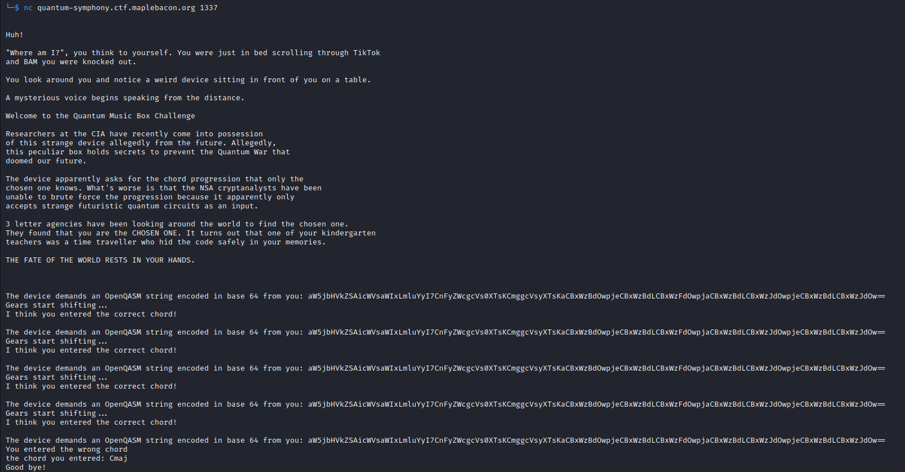

<link rel="stylesheet" href="assets/css/custom.css">

# MapleCTF-Writeups

This weekend from September 29th to October 1st, I competed in the MapleCTF competition as a part of the [49th Security Division](https://49sd.com)! Our team name was "stack smashing slackers."

This competition was really fun! Our team ended up in 38th place with 825 points! I personally solved 4 challenges (and submitted the challenge flag for the survey, but there's not much there for a writeup), earning 725 points for my team!

Thank you so much to the Maple Bacon team from University of British Columbia for hosting this competition! I hope to compete next year too!

# Misc: A Quantum Symphony

**Points:** 425

**Author:** hiswui

**Description:** On what seemed like an ordinary day of lazing around on your couch, you were suddenly kidnapped by the US intelligence agencies. They claim that you know the secret song that prevents the impending Quantum apocalypse. The answer seems to lie with your kindergarten teacher Ms. Matter Eviller. You being to recall a strange song that has been stuck in your head since childhood...

`nc quantum-symphony.ctf.maplebacon.org 1337`

**Files:** [dist.zip](files/quantum/dist[1])

## Writeup

This was probably my favorite challenge of those I completed! It was really fun, involving quantum computing and a bit of music theory!

First, in the dist.zip file, there is a file, server.py. It includes these contents:

```py
#!/usr/bin/env python3

from qiskit import QuantumCircuit
import qiskit.quantum_info as qi
from base64 import b64decode
from secret import CHORD_PROGRESSION, FLAG, LORE

QUBITS = 4

# No flat notes because they're just enharmonic to the sharps
NOTE_MAP = {
    '0000': 'C',
    '0001': 'C#',
    '0010': 'D',
    '0011': 'D#',
    '0100': 'E',
    '0101': 'F',
    '0110': 'F#',
    '0111': 'G',
    '1000': 'G#',
    '1001': 'A',
    '1010': 'A#',
    '1011': 'B',
    '1100': 'X', # misc note (aka ignore these)
    '1101': 'X',
    '1110': 'X',
    '1111': 'X',
}

# legend says that one only requires the major and minor chords to unlock the secret gates
CHORD_MAP = {
    'Cmaj' : {'C', 'E', 'G'},
    'C#maj': {'C#', 'E#', 'G#'},
    'Dmaj' : {'D', 'F#', 'A'},
    'D#maj': {'D#', 'G', 'A#'},
    'Emaj' : {'E', 'G#', 'B'},
    'Fmaj' : {'F', 'A', 'C'},
    'Gmaj' : {'G', 'B', 'D'},
    'G#maj': {'G#', 'C', 'D#'}, 
    'Amaj' : {'A', 'C#', 'E'},
    'A#maj': {'A#', 'D', 'F'},
    'Bmaj' : {'N', 'D', 'F#'},

    'Cmin' : {'C', 'D#', 'G'},
    'C#min': {'C#', 'E', 'G#'},
    'Dmin' : {'D', 'F', 'A'},
    'D#min': {'D#', 'F#', 'A#'},
    'Emin' : {'E', 'G', 'B'},
    'Fmin' : {'F', 'G#', 'C'},
    'F#min': {'F#', 'A', 'C#'}, 
    'Gmin' : {'G', 'A#', 'D'},
    'G#min': {'G#', 'B', 'D#'},
    'Amin' : {'A', 'C', 'E'},
    'A#min': {'A#', 'C#', 'F'},
    'Bmin' : {'B', 'D', 'F#'}
}


def get_chord_from_sv(state_vector) -> str:
    '''
    Returns the correct chord from the CHORD_MAP corresponding to the superposition of the 
    '''
    state_to_probability_map = [(bin(i)[2:].rjust(QUBITS, '0'), state_vector[i].real ** 2) for i in range(len(state_vector))]
    state_to_probability_map.sort(key=lambda pair: pair[1], reverse=True)
    notes = set()

    for i in range(3):
        qubit_state, probability = state_to_probability_map[i]
        notes.add(NOTE_MAP[qubit_state])

    if notes in CHORD_MAP.values():
        for chord in CHORD_MAP.keys():
            if notes == CHORD_MAP[chord]:
                return chord
    return 'INVALID_CHORD'


def get_circuit():
    try:
        qasm_str = b64decode(input("\nThe device demands an OpenQASM string encoded in base 64 from you: ")).decode()
    except:
        print("The device makes some angry noises. Perhaps there was an error decoding b64!")
        exit(0)
    try:
        circ = QuantumCircuit.from_qasm_str(qasm_str)
        circ.remove_final_measurements(inplace=True)
    except:
        print("The device looks sick from your Circuit. It advises you to use the Qiskit Transpiler in order to decompose your circuit into the basis gates (Rx. Ry, Rz, CNOT)")
        exit(0)
    if circ.num_qubits != QUBITS:
        print(f"Your quantum circuit acts on {circ.num_qubits} instead of {QUBITS} qubits!")
        exit(0)
    return circ


def main():
    print(LORE)  
    for chord in CHORD_PROGRESSION:
        circ = get_circuit()
        sv = qi.Statevector.from_instruction(circ)

        # Note from an anonymous NSA cryptanalyst: 
        # I wish there was some way I could convert a zero state vector to any arbitrary state vector of my choosing,,, I feel like I'm so close.
        input_chord = get_chord_from_sv(sv)
        if input_chord != chord:
            print("You entered the wrong chord")
            print(f"the chord you entered: {input_chord}")
            print('Good bye!')
            exit(0)
        print("Gears start shifting...")
        print("I think you entered the correct chord!")

    print("Woah... The device is shaking..,")
    print("The device has been unlocked.")
    print("you see a piece of paper hidden away inside, securely between the gears.")
    print("You pick it up and begin to read it:")
    print(FLAG)

if __name__ == "__main__":
    main()


```

Some important things to note with this code are that it reads user input in the form of OpenQASM strings encoded in base64 to then check if a chord is a correct chord in a progression. It does this by checking the first three highest-probability states of the quantum computer and comparing these with states assigned to musical notes.

In quantum computing, "superpositions" are used where the computer has multiple states at the same time, but different probabilities of each state being measured. The combination of all state probabilities in the quantum computer is the state-vector. The state-vector stores a square-root version of the probability to allow for different "phases," but that doesn't matter for the purpose of this challenge.

Some common quantum logic gates (similar to AND, NOT, OR, etc., but for quantum purposes) are the Hadamard gate (H), Pauli-X gate (X), controlled NOT gate (CNOT/CX), Toffoli gate or controlled-controlled-NOT (CCNOT/CCX), and the controlled Hadamard gate (CH). A Hadamard gate creates a superposition, giving the current qubit a 50% chance of being 0 and 50% chance of being 1. Another interesting feature of the gate is that applying it twice cancels it out! The Pauli-X gate simply flips the qubit, making it 1 if originally 0 or 0 if originally 1, similar to the classical NOT gate. Controlled gates like CNOT or CH apply a given gate, such as Pauli-X or Hadamard, respectively, only if another qubit is 1. And CCNOT applies the Pauli-X gate only if two qubits are 1, similar to a classical AND gate. Since OR can be implemented with NOT and AND, there is no need for an elementary equivalent in quantum computing.

For this challenge, we need to convert given states to OpenQASM quantum instructions! For example, for the D minor chord, we need some sort of superposition between D (0010), F (0101), and A (1001). I personally did the C major chord first while solving it, but this is one of the more complicated ones, so it's more useful to explain! My C major implementation was also a bit over-complicated and could be done with just three gates...

Anyways, let's try D minor!

First, for QASM, we need a header to include the standard library and set the quantum computer to 4 qubits!

```qasm
include "qelib1.inc";
qreg q[4];
```

How, the first qubit on the left (qubit 3) can be 1 or 0, and if it is 1, so is qubit 0 on the far right. Combined, these would give the note of A! We can set a superposition for qubit 3 with the Hadamard gate applied to it and then use CNOT/CX to set qubit 0 to 1 if qubit 3 is 1.

```qasm
h q[3];
cx q[3], q[0];
```

If qubit 3 is 0, qubit 2 can be 1 or 0 as well! And if it is 1, so is qubit 0, creating the note of F! Now, we need a sort of "if-not"... Well, the Pauli-X gate works just like a NOT and CH applies the Hadamard gate with a condition! Since we want a superposition, we need this rather than CNOT. So we can flip qubit 3 with an X gate, apply CH to 3 and 2, and flip back qubit 3 later with another X gate! We won't do this yet, though, since we still need this qubit for another "if-not" later! And since we need qubit 0 to match qubit 2, we can use another CNOT/CX applied to 2 and 0!

```qasm
x q[3];
ch q[3], q[2];
cx q[2], q[0];
```

Now, we need to set qubit 1 (second from right) to 1 if both qubits 3 and 2 are 0. We can do the same "if-not" by flipping with a Pauli-X gate first, and luckily still have qubit 3 flipped from earlier, but now with a CCNOT! In classical terms, this sets qubit 1 to `NOT(q[3]) AND NOT(q[2])` which is exactly what we want! And we can end by flipping back qubits 2 and 3 to their previous states!

```qasm
x q[2];
ccx q[3], q[2], q[1];
x q[2];
x q[3];
```


Similar logic can be used to generate QASM code for any combination of notes! And theoretically, the other states don't actually have to be 0 probability like I did here, as long as they are not the first three highest probabilities. It's easiest to control this by only allowing three notes to have any probability, but any method of controlling the most likely qubits would work!

Here are the QASM code and base64-encoded versions for all of the chords included. However, C# major and B major both have errors in them... C# major includes a non-existent E# (it would just be F) and B major looks for N instead of B. So we can simply ignore these since they won't show up at all during the challenge! Anyways, here's the code!

C major:

```qasm
include "qelib1.inc";
qreg q[4];

h q[2];
h q[0];
cx q[0], q[1];
ch q[0], q[2];
cx q[0], q[2];
```

Base64-encoded: `aW5jbHVkZSAicWVsaWIxLmluYyI7CnFyZWcgcVs0XTsKCmggcVsyXTsKaCBxWzBdOwpjeCBxWzBdLCBxWzFdOwpjaCBxWzBdLCBxWzJdOwpjeCBxWzBdLCBxWzJdOw==`

D major:

```qasm
include "qelib1.inc";
qreg q[4];

h q[1];
x q[1];
cx q[1], q[0];
cx q[1], q[3];
x q[1];
ch q[1], q[2];
```

Base64-encoded: `aW5jbHVkZSAicWVsaWIxLmluYyI7CnFyZWcgcVs0XTsKCmggcVsxXTsKeCBxWzFdOwpjeCBxWzFdLCBxWzBdOwpjeCBxWzFdLCBxWzNdOwp4IHFbMV07CmNoIHFbMV0sIHFbMl07`

D# major:

```qasm
include "qelib1.inc";
qreg q[4];

x q[1];
h q[0];
ch q[0], q[2];
x q[0];
cx q[0], q[3];
x q[0];
```

Base64-encoded: `aW5jbHVkZSAicWVsaWIxLmluYyI7CnFyZWcgcVs0XTsKCnggcVsxXTsKaCBxWzBdOwpjaCBxWzBdLCBxWzJdOwp4IHFbMF07CmN4IHFbMF0sIHFbM107CnggcVswXTs=`

E major:

```qasm
include "qelib1.inc";
qreg q[4];

h q[3];
ch q[3], q[0];
cx q[0], q[1];
x q[3];
cx q[3], q[2];
x q[3];
```

Base64-encoded: `aW5jbHVkZSAicWVsaWIxLmluYyI7CnFyZWcgcVs0XTsKCmggcVszXTsKY2ggcVszXSwgcVswXTsKY3ggcVswXSwgcVsxXTsKeCBxWzNdOwpjeCBxWzNdLCBxWzJdOwp4IHFbM107`

F major:

```qasm
include "qelib1.inc";
qreg q[4];

h q[3];
x q[3];
ch q[3], q[2];
x q[3];
cx q[3], q[0];
cx q[2], q[0];
```

Base64-encoded: `aW5jbHVkZSAicWVsaWIxLmluYyI7CnFyZWcgcVs0XTsKCmggcVszXTsKeCBxWzNdOwpjaCBxWzNdLCBxWzJdOwp4IHFbM107CmN4IHFbM10sIHFbMF07CmN4IHFbMl0sIHFbMF07`

G major:

```qasm
include "qelib1.inc";
qreg q[4];

x q[1];
h q[3];
x q[3];
ch q[3], q[2];
x q[3];
cx q[3], q[0];
cx q[2], q[0];
```

Base64-encoded: `aW5jbHVkZSAicWVsaWIxLmluYyI7CnFyZWcgcVs0XTsKCnggcVsxXTsKaCBxWzNdOwp4IHFbM107CmNoIHFbM10sIHFbMl07CnggcVszXTsKY3ggcVszXSwgcVswXTsKY3ggcVsyXSwgcVswXTs=`

G# major:

```qasm
include "qelib1.inc";
qreg q[4];

h q[3];
x q[3];
ch q[3], q[0];
x q[3];
cx q[0], q[1];
```

Base64-encoded: `aW5jbHVkZSAicWVsaWIxLmluYyI7CnFyZWcgcVs0XTsKCmggcVszXTsKeCBxWzNdOwpjaCBxWzNdLCBxWzBdOwp4IHFbM107CmN4IHFbMF0sIHFbMV07`

A major:

```qasm
include "qelib1.inc";
qreg q[4];

h q[2];
x q[2];
cx q[2], q[0];
ch q[2], q[3];
x q[2];

```

Base64-encoded: `aW5jbHVkZSAicWVsaWIxLmluYyI7CnFyZWcgcVs0XTsKCmggcVsyXTsKeCBxWzJdOwpjeCBxWzJdLCBxWzBdOwpjaCBxWzJdLCBxWzNdOwp4IHFbMl07Cg==`

A# major:

```qasm
include "qelib1.inc";
qreg q[4];

h q[2];
cx q[2], q[0];
x q[2];
cx q[2], q[1];
ch q[2], q[3];
x q[2];

```

Base64-encoded: `aW5jbHVkZSAicWVsaWIxLmluYyI7CnFyZWcgcVs0XTsKCmggcVsyXTsKY3ggcVsyXSwgcVswXTsKeCBxWzJdOwpjeCBxWzJdLCBxWzFdOwpjaCBxWzJdLCBxWzNdOwp4IHFbMl07Cg==`

C minor:

```qasm
include "qelib1.inc";
qreg q[4];

h q[0];
cx q[0], q[1];
ch q[0], q[2];
```

Base64-encoded: `aW5jbHVkZSAicWVsaWIxLmluYyI7CnFyZWcgcVs0XTsKCmggcVswXTsKY3ggcVswXSwgcVsxXTsKY2ggcVswXSwgcVsyXTs=`

C# minor:

```qasm
include "qelib1.inc";
qreg q[4];

h q[3];
x q[3];
ch q[3], q[2];
x q[2];
ccx q[3], q[2], q[0];
x q[2];
x q[3];
```

Base64-encoded: `aW5jbHVkZSAicWVsaWIxLmluYyI7CnFyZWcgcVs0XTsKCmggcVszXTsKeCBxWzNdOwpjaCBxWzNdLCBxWzJdOwp4IHFbMl07CmNjeCBxWzNdLCBxWzJdLCBxWzBdOwp4IHFbMl07CnggcVszXTs=`

D minor:

```qasm
include "qelib1.inc";
qreg q[4];

h q[3];
cx q[3], q[0];
x q[3];
ch q[3], q[2];
cx q[2], q[0];
x q[2];
ccx q[3], q[2], q[1];
x q[2];
x q[3];
```

Base64-encoded: `aW5jbHVkZSAicWVsaWIxLmluYyI7CnFyZWcgcVs0XTsKCmggcVszXTsKY3ggcVszXSwgcVswXTsKeCBxWzNdOwpjaCBxWzNdLCBxWzJdOwpjeCBxWzJdLCBxWzBdOwp4IHFbMl07CmNjeCBxWzNdLCBxWzJdLCBxWzFdOwp4IHFbMl07CnggcVszXTs=`

D# minor:

```qasm
include "qelib1.inc";
qreg q[4];

x q[1];
h q[3];
x q[3];
ch q[3], q[2];
x q[2];
ccx q[3], q[2], q[0];
x q[2];
x q[3];
```

Base64-encoded: `aW5jbHVkZSAicWVsaWIxLmluYyI7CnFyZWcgcVs0XTsKCnggcVsxXTsKaCBxWzNdOwp4IHFbM107CmNoIHFbM10sIHFbMl07CnggcVsyXTsKY2N4IHFbM10sIHFbMl0sIHFbMF07CnggcVsyXTsKeCBxWzNdOw==`

E minor:

```qasm
include "qelib1.inc";
qreg q[4];

h q[3];
x q[3];
cx q[3], q[2];
x q[3];
ch q[2], q[1];
cx q[3], q[1];
cx q[1], q[0];

```

Base64-encoded: `aW5jbHVkZSAicWVsaWIxLmluYyI7CnFyZWcgcVs0XTsKCmggcVszXTsKeCBxWzNdOwpjeCBxWzNdLCBxWzJdOwp4IHFbM107CmNoIHFbMl0sIHFbMV07CmN4IHFbM10sIHFbMV07CmN4IHFbMV0sIHFbMF07Cg==`

F minor:

```qasm
include "qelib1.inc";
qreg q[4];

h q[3];
x q[3];
ch q[3], q[2];
cx q[2], q[0];
x q[3];

```

Base64-encoded: `aW5jbHVkZSAicWVsaWIxLmluYyI7CnFyZWcgcVs0XTsKCmggcVszXTsKeCBxWzNdOwpjaCBxWzNdLCBxWzJdOwpjeCBxWzJdLCBxWzBdOwp4IHFbM107Cg==`

F# minor:

```qasm
include "qelib1.inc";
qreg q[4];

h q[0];
x q[0];
cx q[0], q[2];
cx q[0], q[1];
x q[0];
ch q[0], q[3];
```

Base64-encoded: `aW5jbHVkZSAicWVsaWIxLmluYyI7CnFyZWcgcVs0XTsKCmggcVswXTsKeCBxWzBdOwpjeCBxWzBdLCBxWzJdOwpjeCBxWzBdLCBxWzFdOwp4IHFbMF07CmNoIHFbMF0sIHFbM107`

G minor:

```qasm
include "qelib1.inc";
qreg q[4];

x q[1];
h q[2];
cx q[2], q[0];
x q[2];
ch q[2], q[3];
x q[2];
```

Base64-encoded: `aW5jbHVkZSAicWVsaWIxLmluYyI7CnFyZWcgcVs0XTsKCnggcVsxXTsKaCBxWzJdOwpjeCBxWzJdLCBxWzBdOwp4IHFbMl07CmNoIHFbMl0sIHFbM107CnggcVsyXTs=`

G# minor:

```qasm
include "qelib1.inc";
qreg q[4];

h q[3];
ch q[3], q[1];
x q[3];
cx q[3], q[1];
x q[3];
cx q[1], q[0];
```

Base64-encoded: `aW5jbHVkZSAicWVsaWIxLmluYyI7CnFyZWcgcVs0XTsKCmggcVszXTsKY2ggcVszXSwgcVsxXTsKeCBxWzNdOwpjeCBxWzNdLCBxWzFdOwp4IHFbM107CmN4IHFbMV0sIHFbMF07`

A minor:

```qasm
include "qelib1.inc";
qreg q[4];

h q[3];
cx q[3], q[0];
x q[3];
ch q[3], q[2];
x q[3];
```

Base64-encoded: `aW5jbHVkZSAicWVsaWIxLmluYyI7CnFyZWcgcVs0XTsKCmggcVszXTsKY3ggcVszXSwgcVswXTsKeCBxWzNdOwpjaCBxWzNdLCBxWzJdOwp4IHFbM107`

A# minor:

```qasm
include "qelib1.inc";
qreg q[4];

h q[0];
ch q[0], q[2];
x q[0];
cx q[0], q[1];
cx q[0], q[3];
x q[0];
```

Base64-encoded: `aW5jbHVkZSAicWVsaWIxLmluYyI7CnFyZWcgcVs0XTsKCmggcVswXTsKY2ggcVswXSwgcVsyXTsKeCBxWzBdOwpjeCBxWzBdLCBxWzFdOwpjeCBxWzBdLCBxWzNdOwp4IHFbMF07`

B minor:

```qasm
include "qelib1.inc";
qreg q[4];

x q[1];
h q[0];
cx q[0], q[3];
x q[0];
ch q[0], q[2];
x q[0];
```

Base64-encoded: `aW5jbHVkZSAicWVsaWIxLmluYyI7CnFyZWcgcVs0XTsKCnggcVsxXTsKaCBxWzBdOwpjeCBxWzBdLCBxWzNdOwp4IHFbMF07CmNoIHFbMF0sIHFbMl07CnggcVswXTs=`


Now that we know how to give the program specific notes, we can start interacting with it!

Using the netcat listener we were given, we can try C major a couple times and see what it gives us!



Turns out our first 4 chords are C major!

We can use Python and pwntools to automate the previously found chords in the progression to make figuring the rest out a bit easier!

```py
from pwn import *

r = remote('quantum-symphony.ctf.maplebacon.org', 1337)

prog = ["Cmaj", "Cmaj", "Cmaj", "Cmaj"]

CHORDS = {
"Cmaj": "aW5jbHVkZSAicWVsaWIxLmluYyI7CnFyZWcgcVs0XTsKCmggcVsyXTsKaCBxWzBdOwpjeCBxWzBdLCBxWzFdOwpjaCBxWzBdLCBxWzJdOwpjeCBxWzBdLCBxWzJdOw==",
"Dmaj": "aW5jbHVkZSAicWVsaWIxLmluYyI7CnFyZWcgcVs0XTsKCmggcVsxXTsKeCBxWzFdOwpjeCBxWzFdLCBxWzBdOwpjeCBxWzFdLCBxWzNdOwp4IHFbMV07CmNoIHFbMV0sIHFbMl07",
"D#maj": "aW5jbHVkZSAicWVsaWIxLmluYyI7CnFyZWcgcVs0XTsKCnggcVsxXTsKaCBxWzBdOwpjaCBxWzBdLCBxWzJdOwp4IHFbMF07CmN4IHFbMF0sIHFbM107CnggcVswXTs=",
"Emaj": "aW5jbHVkZSAicWVsaWIxLmluYyI7CnFyZWcgcVs0XTsKCmggcVszXTsKY2ggcVszXSwgcVswXTsKY3ggcVswXSwgcVsxXTsKeCBxWzNdOwpjeCBxWzNdLCBxWzJdOwp4IHFbM107",
"Fmaj": "aW5jbHVkZSAicWVsaWIxLmluYyI7CnFyZWcgcVs0XTsKCmggcVszXTsKeCBxWzNdOwpjaCBxWzNdLCBxWzJdOwp4IHFbM107CmN4IHFbM10sIHFbMF07CmN4IHFbMl0sIHFbMF07",
"Gmaj": "aW5jbHVkZSAicWVsaWIxLmluYyI7CnFyZWcgcVs0XTsKCnggcVsxXTsKaCBxWzNdOwp4IHFbM107CmNoIHFbM10sIHFbMl07CnggcVszXTsKY3ggcVszXSwgcVswXTsKY3ggcVsyXSwgcVswXTs=",
"G#maj": "aW5jbHVkZSAicWVsaWIxLmluYyI7CnFyZWcgcVs0XTsKCmggcVszXTsKeCBxWzNdOwpjaCBxWzNdLCBxWzBdOwp4IHFbM107CmN4IHFbMF0sIHFbMV07",
"Amaj": "aW5jbHVkZSAicWVsaWIxLmluYyI7CnFyZWcgcVs0XTsKCmggcVsyXTsKeCBxWzJdOwpjeCBxWzJdLCBxWzBdOwpjaCBxWzJdLCBxWzNdOwp4IHFbMl07Cg==",
"A#maj": "aW5jbHVkZSAicWVsaWIxLmluYyI7CnFyZWcgcVs0XTsKCmggcVsyXTsKY3ggcVsyXSwgcVswXTsKeCBxWzJdOwpjeCBxWzJdLCBxWzFdOwpjaCBxWzJdLCBxWzNdOwp4IHFbMl07Cg==",
"Cmin":"aW5jbHVkZSAicWVsaWIxLmluYyI7CnFyZWcgcVs0XTsKCmggcVswXTsKY3ggcVswXSwgcVsxXTsKY2ggcVswXSwgcVsyXTs=",
"C#min":"aW5jbHVkZSAicWVsaWIxLmluYyI7CnFyZWcgcVs0XTsKCmggcVszXTsKeCBxWzNdOwpjaCBxWzNdLCBxWzJdOwp4IHFbMl07CmNjeCBxWzNdLCBxWzJdLCBxWzBdOwp4IHFbMl07CnggcVszXTs=",
"Dmin":"aW5jbHVkZSAicWVsaWIxLmluYyI7CnFyZWcgcVs0XTsKCmggcVszXTsKY3ggcVszXSwgcVswXTsKeCBxWzNdOwpjaCBxWzNdLCBxWzJdOwpjeCBxWzJdLCBxWzBdOwp4IHFbMl07CmNjeCBxWzNdLCBxWzJdLCBxWzFdOwp4IHFbMl07CnggcVszXTs=",
"D#min":"aW5jbHVkZSAicWVsaWIxLmluYyI7CnFyZWcgcVs0XTsKCnggcVsxXTsKaCBxWzNdOwp4IHFbM107CmNoIHFbM10sIHFbMl07CnggcVsyXTsKY2N4IHFbM10sIHFbMl0sIHFbMF07CnggcVsyXTsKeCBxWzNdOw==",
"Emin":"aW5jbHVkZSAicWVsaWIxLmluYyI7CnFyZWcgcVs0XTsKCmggcVszXTsKeCBxWzNdOwpjeCBxWzNdLCBxWzJdOwp4IHFbM107CmNoIHFbMl0sIHFbMV07CmN4IHFbM10sIHFbMV07CmN4IHFbMV0sIHFbMF07Cg==",
"Fmin":"aW5jbHVkZSAicWVsaWIxLmluYyI7CnFyZWcgcVs0XTsKCmggcVszXTsKeCBxWzNdOwpjaCBxWzNdLCBxWzJdOwpjeCBxWzJdLCBxWzBdOwp4IHFbM107Cg==",
"F#min":"aW5jbHVkZSAicWVsaWIxLmluYyI7CnFyZWcgcVs0XTsKCmggcVswXTsKeCBxWzBdOwpjeCBxWzBdLCBxWzJdOwpjeCBxWzBdLCBxWzFdOwp4IHFbMF07CmNoIHFbMF0sIHFbM107",
"Gmin":"aW5jbHVkZSAicWVsaWIxLmluYyI7CnFyZWcgcVs0XTsKCnggcVsxXTsKaCBxWzJdOwpjeCBxWzJdLCBxWzBdOwp4IHFbMl07CmNoIHFbMl0sIHFbM107CnggcVsyXTs=",
"G#min":"aW5jbHVkZSAicWVsaWIxLmluYyI7CnFyZWcgcVs0XTsKCmggcVszXTsKY2ggcVszXSwgcVsxXTsKeCBxWzNdOwpjeCBxWzNdLCBxWzFdOwp4IHFbM107CmN4IHFbMV0sIHFbMF07",
"Amin":"aW5jbHVkZSAicWVsaWIxLmluYyI7CnFyZWcgcVs0XTsKCmggcVszXTsKY3ggcVszXSwgcVswXTsKeCBxWzNdOwpjaCBxWzNdLCBxWzJdOwp4IHFbM107",
"A#min":"aW5jbHVkZSAicWVsaWIxLmluYyI7CnFyZWcgcVs0XTsKCmggcVswXTsKY2ggcVswXSwgcVsyXTsKeCBxWzBdOwpjeCBxWzBdLCBxWzFdOwpjeCBxWzBdLCBxWzNdOwp4IHFbMF07",
"Bmin":"aW5jbHVkZSAicWVsaWIxLmluYyI7CnFyZWcgcVs0XTsKCnggcVsxXTsKaCBxWzBdOwpjeCBxWzBdLCBxWzNdOwp4IHFbMF07CmNoIHFbMF0sIHFbMl07CnggcVswXTs="
}

for chord in prog:
	c = CHORDS[chord]
	print(r.recv().decode())
	print(f"Sending... {chord}")
	r.send(c.encode()+b"\n")

for chord in CHORDS:
	print(f"{chord}: {CHORDS[chord]}")

r.interactive()
```

This code creates a connection with the server and repeatedly first recieves data from the server and sends it the next chord's base64-encoded QASM code. The chord progression is changed by just modifying the `prog` list!

Once the progression is done, it prints all the chords for easy access and then makes the session interactive so you can continue!

And for predicting the chord, we don't need to go through everything... It appears the music is in the key of C, which means we can most likely expect F major, G major, A minor, D minor, or of course, C major!

Trying this out, we can start getting more information, including that the next two chords are F major!


Doing this repeatedly, eventually, we get the progression `["Cmaj", "Cmaj", "Cmaj", "Cmaj", "Fmaj", "Fmaj", "Cmaj", "Cmaj", "Gmaj", "Fmaj", "Cmaj", "Gmaj"]`, which can give us the flag!


And our flag is `maple{qu4ntum_p34c3_c0d3_1s_m3m3nt0_m0r1}`!


# Other writeups coming soon!
